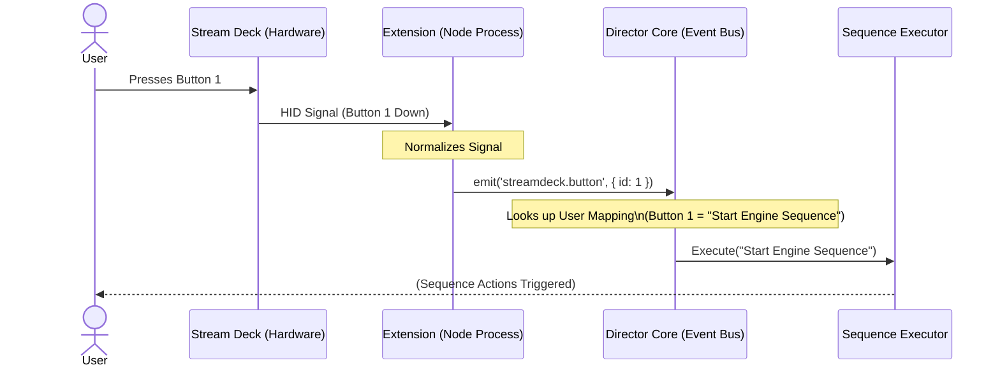

# Feature: Director Extension System & Product Refinement

## 1. Product Vision & Philosophy

### 1.1 Core Philosophy
**"Orchestrate the Chaos"**

The Sim RaceCenter Director is an **Open Source Race Broadcast Orchestrator**. It serves as the secure on-premise agent for Sim RaceCenter's premium cloud automation, while also providing a standalone interface for manually triggering local broadcast sequences.

*   **Open Source Foundation**: The Core App and its execution engine are free and open source. If it runs locally on the user's hardware and requires no cloud compute from us, it is free.
*   **Extensions as Building Blocks**: functionality (Discord, Lighting, etc.) is not simple feature flags but independent **extensions**. This encourages community contribution.
*   **Premium Value**: We monetize the *intelligence*, not the *mechanics*.
    *   **Free**: Manual triggering of complex sequences (Stream Deck style).
    *   **Premium**: AI-driven automation (Race Control Cloud) that triggers those sequences automatically based on race context.

### 1.2 The Two-Tier Product Model

| Feature | Open Source (Core) | Premium (Cloud) |
| :--- | :--- | :--- |
| **Execution Engine** | Local Director Loop | n/a |
| **Native Support** | OBS Studio Integration | n/a |
| **Integrations** | Community Extensions (Discord, etc) | n/a |
| **Control** | **"Control Deck"** (Manual Buttons) | **"AI Director"** (Auto-triggering) |
| **Cost** | Free (Apache/MIT) | Subscription |

---

## 2. Feature Specification: The Extension System

To support this vision, the Director App architecture must shift from a monolithic application to a modular host.

### 2.1 Core Application Responsibilities
The "Core" is now a lightweight host responsible for:
1.  **Extension Lifecycle**: Loading, enabling, disabling, and isolating extensions.
2.  **The "Director Loop"**: The central heartbeat that processes queued commands.
3.  **The Sequence Executor**: The engine that executes strict lists of actions (e.g., "Mute Discord" -> "Wait 2s" -> "Switch OBS").
4.  **OBS Integration**: First-class, native support for OBS Studio control, ensuring maximum reliability for the broadcast's most critical component.
5.  **The "Control Deck" UI**: A customizable grid of buttons allowing the user to manually trigger sequences.

### 2.2 Extension Capabilities
An extension is a self-contained package (inspired by VS Code extensions) that can interact with the Core via a defined API.

#### Anatomy of an Extension
An extension consists of:
1.  **Manifest (`package.json`)**: Defines metadata, activation events, and contribution points.
2.  **Main Process (Node.js)**: The implementation of the logic (connecting to Discord Gateway, Hue Bridge, etc.).
3.  **Renderer Process (React)**:
    *   **Dashboard Widget**: A small summary card for the home screen (e.g., Discord: Connected).
    *   **Settings/Panel**: A dedicated full-page UI for configuration and deep control.

#### Contribution Points
Extensions contribute functionality to the Core via the `manifest`. Crucially, **Intents** must be self-describing to support the AI agent's inference engine.

*   **`intents`**: High-level semantic actions the extension can perform (e.g., `communication.announceToDrivers`, `lighting.signalRaceStart`).
    *   **Abstraction Layer**: The AI executes *Intents*, not low-level actions.
    *   **Static Intents**: Simple built-in capabilities (e.g., "Send Message").
    *   **User-Defined Intents**: Complex configurations created by the user within the extension (e.g., a specific light show pattern) and exposed as a high-level intent (e.g., `lighting.victoryLap`).
    *   Must include **Input Schema** (JSON Schema): Defines required parameters (e.g., "messageText").
*   **`events`**: Triggers that the Core can listen to (e.g., `streamdeck.buttonPressed`, `iracing.flagChanged`).
    *   **Usage**: Enables hardware controllers (Stream Deck, Button Boxes) or external webhooks to initiate Director sequences.
*   **`settings`**: Configuration schema (e.g., API Keys, IP addresses).

### 2.4 Event-Driven Triggers (Hardware Support)
To support hardware controllers, extensions can emit events that the user maps to specific Director Sequences.

#### Example: Stream Deck Integration
In this flow, the extension acts as a driver layer. It does not know *what* the button does, only that it was pressed. The Core handles the mapping and execution.



### 2.5 Intent Discovery & Context Sync
To ensure the Cloud AI can create sequences effectively:

1.  **The Intent Registry**: On load, the Core scans all extension manifests for `intents` and builds a registry.
2.  **Capabilities Handshake**: When connecting to Race Control Cloud, the Director sends a `CapabilitiesManifest` listing all available **Intents**.
    *   *Example:* "I have an intent `communication.announceToDrivers` that accepts `text`."
3.  **The "Black Box" Approach**: The AI decides *what* it wants to achieve (the intent) but delegates the *how* (the implementation details) to the local extension.
    *   *AI Logic:* "There is a crash. I should `communication.announceToDrivers('Safety Car Deployed')`."
    *   *Extension Logic:* Receives intent -> Generates TTS -> Connects to Discord -> Plays Audio.

---

## 3. User Experience (UX)

### 3.1 The "Control Deck" (New Core Feature)
Instead of just waiting for cloud commands, the user is presented with a **Control Deck** interface.
*   **Visuals**: A grid of physically distinct buttons (Stream Deck aesthetic).
*   **Function**: Users map a generic button (e.g., "Safety Car Protocol") to a Sequence of Actions provided by installed extensions.
*   **Example**:
    *   Button: "Race Start"
    *   Sequence:
        1.  `obs:switch-scene("Race Cam")`
        2.  `audio:play-file("intro.mp3")`
        3.  `discord:unmute-all()`

### 3.2 Extension Management
*   **Marketplace/Browser**: Users can browse available extensions (from a JSON registry or GitHub).
*   **Side Bar**: Installed extensions appear as icons in the left nav (just like VS Code). Clicking one opens its "Main Panel".

### 3.3 Trigger Configuration (Event Mapping)
To bridge the gap between "unknown events" and sequences, the Core provides a **Trigger Editor**.

1.  **Discovery**: The Core knows about available events because extensions declare them in their manifest (with a schema).
2.  **Configuration flow**:
    *   User opens the **Sequence Editor**.
    *   Creates a Sequence (e.g., "End Race").
    *   Clicks **"Add Trigger"**.
    *   Selects **"Extension Event"**.
    *   Dropdown 1 (Source): `Stream Deck Extension`
    *   Dropdown 2 (Event): `Button Pressed`
    *   Input (Filter): `Button ID` = `15`
3.  **Storage**: These mappings are stored in the Core's `user-config.json`, effectively subscribing the Sequence Executor to the specific event pattern.

---

## 4. Technical Architecture Migration

### Phase 1: Decoupling (Current Step)
Refactor existing hardcoded integrations (Discord) into the new internal folder structure `src/extensions/`.
*   Establish `ExtensionHost` service.
*   Define `ExtensionAPI` interface.

### Phase 2: The Manifest
Create the definition for `director-extension.json` or extend `package.json`.
```json
{
  "name": "director-streamdeck-integration",
  "contributes": {
    "events": [
      { 
        "event": "streamdeck.buttonDown", 
        "title": "Button Pressed",
        "schema": {
          "type": "object",
          "properties": { "buttonId": { "type": "integer" } }
        }
      }
    ],
    "views": {
      "panel": "./dist/panel.js"
    }
  }
}
```

### Phase 3: Public API & Sandbox
Ensure extensions cannot crash the main director loop. Implement error boundaries and possibly separate process execution for robust extensions.
