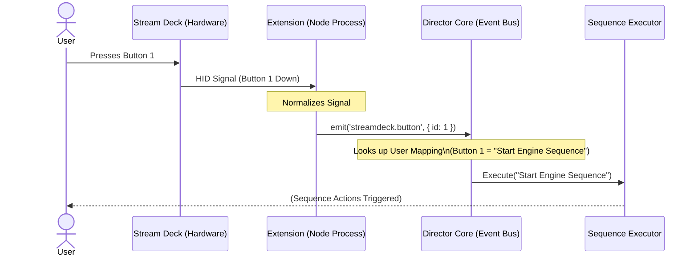

# Feature: Director Extension System & Product Refinement

## 1. Product Vision & Philosophy

### 1.1 Core Philosophy
**"Orchestrate the Chaos"**

The Sim RaceCenter Director is an **Open Source Race Broadcast Orchestrator**. It serves as the secure on-premise agent for Sim RaceCenter's premium cloud automation, while also providing a standalone interface for manually triggering local broadcast sequences.

*   **Open Source Foundation**: The Core App and its execution engine are free and open source. If it runs locally on the user's hardware and requires no cloud compute from us, it is free.
*   **Extensions as Building Blocks**: functionality (Discord, Lighting, etc.) is not simple feature flags but independent **extensions**. This encourages community contribution.
*   **Premium Value**: We monetize the *intelligence*, not the *mechanics*.
    *   **Free**: Manual triggering of complex sequences (Stream Deck style).
    *   **Premium**: AI-driven automation (Race Control Cloud) that triggers those sequences automatically based on race context.

### 1.2 The Two-Tier Product Model

| Feature | Open Source (Core) | Premium (Cloud) |
| :--- | :--- | :--- |
| **Execution Engine** | Local Director Loop | n/a |
| **Integrations** | Extensions (OBS, Discord, iRacing) | n/a |
| **Control** | **"Control Deck"** (Manual Buttons) | **"AI Director"** (Auto-triggering) |
| **Cost** | Free | Subscription |

---

## 2. Feature Specification: The Extension System

To support this vision, the Director App architecture must shift from a monolithic application to a modular host.

### 2.1 Core Application Responsibilities
The "Core" is now a lightweight host responsible for:
1.  **Extension Lifecycle**: Loading, enabling, disabling, and isolating extensions.
2.  **The "Director Loop"**: The central heartbeat that processes queued commands.
3.  **The Sequence Executor**: The engine that executes strict lists of actions (e.g., "Mute Discord" -> "Wait 2s" -> "Switch OBS").
4.  **The "Control Deck" UI**: A customizable grid of buttons allowing the user to manually trigger sequences.

### 2.2 Extension Capabilities
An extension is a self-contained package (inspired by VS Code extensions) that can interact with the Core via a defined API.

#### Anatomy of an Extension
An extension consists of:
1.  **Manifest (`package.json`)**: Defines metadata, activation events, and contribution points.
2.  **Main Process (Node.js)**: The implementation of the logic (connecting to Discord Gateway, Hue Bridge, etc.), running in an isolated utility process.
3.  **Renderer Process (React)**:
    *   **Dashboard Widget**: A small summary card (React component) for the home screen (e.g., Discord: Connected).
    *   **Settings/Panel**: A dedicated full-page React component for configuration and deep control.

#### Contribution Points
Extensions contribute functionality to the Core via the `manifest`. Crucially, **Intents** must be self-describing to support the AI agent's inference engine.

*   **`intents`**: High-level semantic actions the extension can perform (e.g., `communication.announceToDrivers`, `lighting.signalRaceStart`).
    *   **Purpose**: **Automation & AI Control**. The AI executes *Intents* to control the broadcast context.
    *   **Abstraction Layer**: The AI executes *Intents*, not low-level actions.
    *   **Static Intents**: Simple built-in capabilities (e.g., "Send Message").
    *   **User-Defined Intents**: Complex configurations created by the user within the extension (e.g., a specific light show pattern) and exposed as a high-level intent (e.g., `lighting.victoryLap`).
    *   Must include **Input Schema** (JSON Schema): Defines required parameters (e.g., "messageText").
*   **`commands`**: Internal RPC methods for UI interactivity and Configuration.
    *   **Purpose**: **UI & Configuration**. Used by the Extension's Frontend (Panel/Widget) to trigger Main Process logic (e.g., `system.login`, `settings.save`).
    *   **Isolation**: Commands are **NOT** exposed to the Automator or Cloud AI. They are strictly for User interaction via the Control Deck or Extension Panel.
*   **`views`**: React components contributed to the Core UI.
    *   **`dashboard`**: Widgets displayed on the home dashboard (e.g., Status Indicator).
    *   **`sidebar`**: Items added to the main left-hand navigation.
        *   Properties: `icon` (Lucide name), `label`, `targetViewId`.
    *   **`panel`**: Full-page components rendered in the main content area.
*   **`events`**: Triggers that the Core can listen to (e.g., `streamdeck.buttonPressed`, `iracing.flagChanged`).
    *   **Usage**: Enables hardware controllers (Stream Deck, Button Boxes) or external webhooks to initiate Director sequences.

### 2.3 Extension Configuration & Persistence
The Director Core intentionally **does not** provide a unified settings interface or storage mechanism for extensions, with ONE exception: The Master Toggle.

*   **Master Extension Toggle**: The Core Settings page provides a single "Enable/Disable" switch for each installed extension.
    *   **Behavior**: When disabled, the extension is **fully unloaded** from the Extension Host. It consumes no resources, runs no background processes, and removes its contributed Views and Intents from the system.
    *   **Life-Cycle**: Toggling ON triggers the `activate()` method. Toggling OFF triggers the `deactivate()` method (if defined) and then destroys the reference.
*   **Self-Managed State**: Extensions are fully responsible for managing their own granular configuration (API keys, preferences, local data).
*   **Custom UI**: Extensions must provide their own configuration interface within their contributed `panel` view.
    *   **Flexibility**: The `panel` view is the extension's full-canvas playground. Developers can structure this with tabs, navigation menus, or minimal forms as needed.
    *   **Example**: A "YouTube" extension might have a `Status` tab for the current stream and a `Settings` tab for authentication.
*   **No Central Schema**: The `manifest` does not define configuration schemas. The Core treats the extension as a black box that is either "enabled" or "disabled".

### 2.4 Extension Panel UX Requirements
Every extension that manages an external connection (OBS, Discord, iRacing, etc.) **must** provide user controls for that connection within its Panel view. The following patterns are mandatory:

#### Tab-Based Panel Layout
Extensions with both status and configuration should use a **Status / Settings** tab pattern:
*   **Status Tab**: Connection state banner, connect/disconnect buttons, live controls.
*   **Settings Tab**: Host, credentials, preferences, and a save button.

> This pattern is already established by the Discord and OBS extensions and should be followed by all new integrations.

#### User-Controlled Connection Lifecycle
Extensions **must not** auto-connect to external services on startup by default. Instead:
1.  The extension **Panel** provides a **Connect** / **Disconnect** button.
2.  The extension exposes an **`autoConnect`** preference (default: `false`).
3.  If the user enables `autoConnect`, the connection is attempted on startup. Otherwise, the user must click Connect manually.
4.  The connection preference **persists across restarts** via `configService`.

> **Why this matters:** During development and testing, external services (OBS, Discord, iRacing) may not be running. Unconditional auto-connect fills the logs with reconnect errors and obscures real issues. The user must opt in to auto-connect.

#### Anti-Pattern: Using `getStatus().active` for Connection State
> **NEVER** use `extensions.getStatus()[id].active` to determine whether an external system (OBS, iRacing, Discord, etc.) is connected.

The `active` flag from `ExtensionHostService.getStatus()` only indicates whether the extension is **loaded** in the Extension Host — i.e., its `activate()` function has been called. This is always `true` for any enabled extension, regardless of whether the external system is running.

**Extension loaded (active)** ≠ **External system connected**

These are fundamentally different states:
| State | Meaning | Example |
| :--- | :--- | :--- |
| `active = true` | Extension code is running in Extension Host | iRacing extension loaded at startup |
| `connected = true` | External system is reachable and responding | iRacing simulator is running |

Both OBS and iRacing renderer components originally used `active` as a proxy for "connected", resulting in false-positive green indicators. See `feature_iracing_integration.md` Lessons Learned for the full root-cause analysis.

**Correct approach:** Extensions must emit a connection state event (e.g., `iracing.connectionStateChanged`) and the renderer must subscribe to that event. See § 2.7 for the canonical patterns.

### 2.5 Core Module Lifecycle Management

#### The Dual-Layer Problem
Some extensions have a **core module** running in the main process (e.g., `ObsService` in `src/main/modules/obs-core`) alongside an **extension** running in the utility process. This dual architecture exists because the core module must be accessible to IPC handlers and the Sequence Executor directly, while the extension runs isolated.

> **Critical Rule:** When an extension is disabled via `extensions:set-enabled`, the corresponding core module's connection **must** also be stopped. The Extension Host's `setExtensionEnabled` does not automatically stop main-process services — lifecycle hooks in `main.ts` must explicitly call `stop()` on the core module.

#### Implementing Lifecycle Hooks
In `main.ts`, the `extensions:set-enabled` handler must include service-specific hooks:

```typescript
ipcMain.handle('extensions:set-enabled', async (event, extensionId, enabled) => {
    await extensionHost.setExtensionEnabled(extensionId, enabled);

    // Lifecycle hook: stop/start core services tied to extensions
    if (extensionId === 'director-obs') {
        if (!enabled) {
            obsService.stop();
        } else if (configService.get('obs')?.autoConnect) {
            obsService.connect();
        }
    }

    return true;
});
```

#### The `stopping` Flag Pattern (Reconnect-Safe Disconnection)
Services with automatic reconnect loops **must** implement a `stopping` flag to prevent the reconnect cycle from restarting after a deliberate disconnect.

**The bug this prevents:** Calling `disconnect()` on a WebSocket fires the `ConnectionClosed` event. If the event handler unconditionally calls `startReconnect()`, the service can never be stopped — every disconnect immediately triggers a new connection attempt.

```typescript
class MyService {
    private stopping = false;

    onConnectionClosed() {
        if (this.stopping) return; // Don't reconnect after manual stop
        this.startReconnect();
    }

    stop() {
        this.stopping = true;
        clearInterval(this.reconnectInterval);
        this.disconnect();
    }

    connect() {
        this.stopping = false;
        // ... connection logic
    }
}
```

> **This pattern is required** for any service that manages a persistent connection with automatic reconnection (OBS, Discord, future integrations).

### 2.6 Extension Event State Caching (Late-Joiner Problem)

Extension events are fire-and-forget: they are emitted once and delivered to any currently-subscribed listeners. This creates a **late-joiner problem** — if a renderer component mounts *after* an event was emitted, it has no way to retrieve the current state.

#### The Problem
```
1. App starts → iRacing extension activates → polls FindWindowA
2. iRacing NOT running → emits { connected: false }
3. User navigates to Dashboard → DashboardCard mounts
4. DashboardCard subscribes to events → but the event already fired
5. DashboardCard has no state → defaults to false (correct by luck, not by design)
```

The real danger is the inverse: if the simulator *is* running, the card still defaults to `false` until the next state change.

#### The Solution: Event Cache in Main Process
The main process (`main.ts`) caches the **last payload** for each event name in a `Map<string, EventData>`. The renderer can query this cache on mount:

```typescript
// main.ts — event forwarding with cache
const extensionEventCache = new Map<string, { extensionId: string; eventName: string; payload: any }>();
eventBus.on('*', (data) => {
    extensionEventCache.set(data.eventName, data);
    mainWindow?.webContents.send('extension:event', data);
});

ipcMain.handle('extensions:get-last-event', (_event, eventName: string) => {
    return extensionEventCache.get(eventName) ?? null;
});
```

```typescript
// Renderer component — correct mount + subscribe pattern
useEffect(() => {
    // 1. Query cached state on mount
    const init = async () => {
        const lastEvent = await window.electronAPI.extensions.getLastEvent('iracing.connectionStateChanged');
        if (lastEvent?.payload?.connected !== undefined) {
            setConnected(lastEvent.payload.connected);
        }
    };
    init();

    // 2. Subscribe to live updates
    const unsub = window.electronAPI.extensions.onExtensionEvent((data) => {
        if (data.eventName === 'iracing.connectionStateChanged') {
            setConnected(!!data.payload?.connected);
        }
    });
    return () => unsub();
}, []);
```

> **Rule:** Any renderer component that displays state derived from extension events **must** use both `getLastEvent()` on mount **and** `onExtensionEvent()` for live updates. Using only one leads to either stale initial state or missed updates.

### 2.7 Connection State Reporting Patterns

There are two valid patterns for reporting external system connection state to the renderer. Which one to use depends on whether the integration has a Core Module in the main process.

#### Pattern A: Dedicated IPC (Dual-Layer / Core Module Extensions)
Used when a **Core Module** exists in the main process (e.g., OBS).

| Component | Mechanism |
| :--- | :--- |
| State owner | Core Module in main process (e.g., `ObsService`) |
| Renderer queries | Dedicated IPC handler (e.g., `obs:get-status`) |
| Live updates | Renderer polls the IPC handler on an interval |

**When to use:** The core module already lives in the main process with direct access to connection state. A dedicated IPC handler is the simplest approach — the renderer polls (e.g., every 2–3 seconds) and gets a complete status object.

**Example:** OBS returns `{ connected, missingScenes, availableScenes, host, autoConnect }` from `obs:get-status`.

#### Pattern B: Extension Events + Cache (Extension-Only)
Used when the integration runs **entirely in the Extension Host** (e.g., iRacing).

| Component | Mechanism |
| :--- | :--- |
| State owner | Extension code in utility process |
| Renderer queries | `getLastEvent(eventName)` for initial state |
| Live updates | `onExtensionEvent()` subscription |

**When to use:** There is no main-process service to query. The extension emits events via the Event Bus, which the main process caches and forwards to the renderer.

**Example:** iRacing emits `iracing.connectionStateChanged` with `{ connected: boolean }`. The renderer queries `getLastEvent('iracing.connectionStateChanged')` on mount and subscribes for live updates.

#### Decision Table
| Architecture | State Reporting | Example |
| :--- | :--- | :--- |
| Dual-Layer (Core Module + Extension) | Pattern A — Dedicated IPC | OBS |
| Extension-Only | Pattern B — Events + Cache | iRacing |

### 2.8 Event-Driven Triggers (Hardware Support)
To support hardware controllers, extensions can emit events that the user maps to specific Director Sequences.

#### Example: Stream Deck Integration
In this flow, the extension acts as a driver layer. It does not know *what* the button does, only that it was pressed. The Core handles the mapping and execution.



### 2.9 Intent Discovery & Capability Management
To support the Sequence Editor and robust execution, we separate the static definition of capabilities from their runtime execution.

#### 1. The Capability Catalog (Static / Persistence Layer)
*   **Source**: Built at startup by scanning the `package.json` manifests of **all installed** extensions (regardless of enabled/disabled state).
*   **Purpose**: Powers the **Sequence Editor UI**.
    *   Tells the Editor what intents *exist* (e.g., `obs.switchScene`).
    *   Provides metadata (Icon, Label, Input Schema) for the UI.
*   **Persistence**: This data persists as long as the extension is installed.
*   **Editor Behavior**:
    *   **Active**: Extension enabled. Step rendered normally.
    *   **Inactive**: Extension installed but disabled. Step rendered with a "Disabled" warning badge but remains editable.
    *   **Missing**: Extension uninstalled. Step rendered as a "Missing Capabilities" placeholder (preserving raw JSON) so the user can see what used to be there without breaking the sequence file.

#### 2. The Handler Registry (Dynamic / Execution Layer)
*   **Source**: Built dynamically at runtime. Entries are added when an extension calls `registerIntentHandler()` during `activate()` and removed on `deactivate()`.
*   **Purpose**: Powers the **Sequence Executor**.
*   **Execution Behavior (Soft Failure)**:
    *   When the Executor encounters a step (e.g., `obs.switchScene`), it looks up the handler.
    *   **Hit**: The handler function is executed.
    *   **Miss**: The Executor **skips** the step, logs a warning (`[Warn] Extension for intent 'obs.switchScene' is not active`), and proceeds to the next step. It does **not** fail the entire sequence.

#### 3. Capabilities Handshake (Cloud Sync)
*   When connecting to Race Control Cloud, the Director sends the **Capability Catalog** (not just the active registry).
*   This allows the Cloud AI to suggest sequences that *could* be run if the user enabled specific extensions.

### 2.10 Extension Architecture
Extensions are built using the following architecture:

**Main Process (Extension Host)**
*   Extensions run in an isolated Node.js utility process managed by the Extension Host.
*   Each extension exports an `activate(extensionAPI)` function that receives the Extension API.
*   The Extension API provides methods to register intent handlers, emit events, and access configuration.

**Renderer Process (React Components)**
*   Extensions contribute React components directly to the Core UI.
*   **Widget Components**: Displayed on the Dashboard, imported and rendered by the Core.
*   **Panel Components**: Full-page views accessible via navigation, imported and rendered by the Core.
*   Components communicate with the Main Process via the `window.electronAPI.extensions` interface.
*   All communication uses typed IPC calls rather than postMessage/iframes.

**Communication Flow**
```
React Component -> window.electronAPI.extensions.executeIntent()
                                    ↓
                            IPC Main Process
                                    ↓
                           Extension Host Service
                                    ↓
                          Extension Utility Process
                                    ↓
                         Extension Intent Handler
```

    *   *Extension Logic:* Receives intent -> Generates TTS -> Connects to Discord -> Plays Audio.

### 2.11 Extension Dependency Management

> **Status: Known Architectural Gap**
> The current dependency model is acceptable for the monorepo phase but must be addressed before external/community extensions are supported.

#### Current State: Shared Dependency Pool
All extensions ship as part of the Director monorepo. When the Extension Host loads an extension via `require(payload.entryPoint)`, the extension's code resolves imports from the **root `node_modules/`** — the same dependency pool used by the Core Application and every other extension.

```
package.json          ← top-level, declares ALL deps
node_modules/
  koffi/              ← native FFI lib, only used by director-iracing
  js-yaml/            ← YAML parser, only used by director-iracing
  obs-websocket-js/   ← only used by director-obs
  discord.js/         ← only used by director-discord
src/extensions/
  iracing/
    package.json      ← manifest only, no "dependencies" field
    index.ts          ← import koffi from 'koffi' ← resolves from root
```

**Implications:**
1. **No dependency isolation** — every extension can `require()` any package in `node_modules`, including packages intended for other extensions or the Core.
2. **No per-extension dependency declaration** — extension manifests do not declare their runtime dependencies. There is no way to audit what an extension needs without reading its source.
3. **Platform-specific native modules affect the entire build** — `koffi` (Windows FFI) and `@discordjs/opus` (native audio codec) require platform-specific binary compilation. They are installed and bundled for all platforms even when only one extension on one OS needs them.
4. **Implicit version coupling** — if two extensions need different versions of the same package, the monorepo can only provide one version.

#### Why This Is Acceptable Today
- All extensions are **first-party**, developed in the same repo, by the same team.
- The dependency set is small and manageable.
- There are no community or third-party extensions yet.
- The build targets a single platform (Windows) for the primary use case.

#### Future: Per-Extension Dependencies (Phase 4+)
When the project supports community extensions or a marketplace (Phase 4: Public API & Sandbox), the following changes are needed:

1. **Extension `dependencies` field** — Extension manifests should declare their runtime dependencies:
    ```json
    {
      "name": "director-iracing",
      "dependencies": {
        "koffi": "^2.15.0",
        "js-yaml": "^4.1.1"
      }
    }
    ```
2. **Per-extension `node_modules`** — Each extension should resolve dependencies from its own `node_modules/` directory, installed at extension install time.
3. **Native module policy** — Extensions requiring native modules (koffi, sharp, opus) should declare their platform requirements in the manifest:
    ```json
    {
      "platform": ["win32"],
      "nativeModules": ["koffi"]
    }
    ```
4. **Dependency audit** — The Extension Host should validate that an extension only `require()`s declared dependencies, not arbitrary packages.

#### Current Native Module Inventory

| Module | Used By | Platform | Purpose |
| :--- | :--- | :--- | :--- |
| `koffi` | director-iracing | Windows | FFI to user32.dll (broadcast messages) and kernel32.dll (shared memory) |
| `js-yaml` | director-iracing | All | Parse iRacing session info YAML from shared memory |
| `obs-websocket-js` | director-obs | All | WebSocket client for OBS Studio |
| `discord.js` | director-discord | All | Discord Gateway and voice channel integration |
| `@discordjs/opus` | director-discord | All (native) | Opus audio codec for Discord voice |
| `googleapis` | director-youtube | All | YouTube Live Streaming API client |

---

## 3. User Experience (UX)

### 3.1 The "Control Deck" (New Core Feature)
Instead of just waiting for cloud commands, the user is presented with a **Control Deck** interface.
*   **Visuals**: A grid of physically distinct buttons (Stream Deck aesthetic).
*   **Function**: Users map a generic button (e.g., "Safety Car Protocol") to a Sequence of Actions provided by installed extensions.
*   **Example**:
    *   Button: "Race Start"
    *   Sequence:
        1.  `obs.switchScene("Race Cam")`
        2.  `audio.playFile("intro.mp3")`
        3.  `discord.unmuteAll()`

### 3.2 Extension Management
*   **Marketplace/Browser**: Users can browse available extensions (from a JSON registry or GitHub).
*   **Side Bar**: Installed extensions appear as icons in the left nav (just like VS Code). Clicking one opens its "Main Panel".

### 3.3 Trigger Configuration (Event Mapping)
To bridge the gap between "unknown events" and sequences, the Core provides a **Trigger Editor**.

1.  **Discovery**: The Core knows about available events because extensions declare them in their manifest (with a schema).
2.  **Configuration flow**:
    *   User opens the **Sequence Editor**.
    *   Creates a Sequence (e.g., "End Race").
    *   Clicks **"Add Trigger"**.
    *   Selects **"Extension Event"**.
    *   Dropdown 1 (Source): `Stream Deck Extension`
    *   Dropdown 2 (Event): `Button Pressed`
    *   Input (Filter): `Button ID` = `15`
3.  **Storage**: These mappings are stored in the Core's `user-config.json`, effectively subscribing the Sequence Executor to the specific event pattern.

---

## 4. Technical Architecture Migration

### Phase 1: Decoupling (Current Step)
Refactor existing hardcoded integrations (Discord) into the new internal folder structure `src/extensions/`.
*   Establish `ExtensionHost` service.
*   Define `ExtensionAPI` interface.

### Phase 2: The Manifest
Create the definition for extension manifests using `package.json`.
```json
{
  "name": "director-streamdeck-integration",
  "contributes": {
    "events": [
      { 
        "event": "streamdeck.buttonDown", 
        "title": "Button Pressed",
        "schema": {
          "type": "object",
          "properties": { "buttonId": { "type": "integer" } }
        }
      }
    ],
    "views": {
      "dashboard": { "component": "StatusWidget" },
      "sidebar": { "label": "Stream Deck", "icon": "Grid", "target": "main" },
      "panels": [
        { "id": "main", "component": "MainPanel", "title": "Configuration" }
      ]
    }
  }
}
```

**Note**: The `component` field refers to the named export in the extension's renderer entry point (e.g., `src/extensions/{id}/renderer/index.tsx`).

### Phase 3: Dynamic Registry & Routing
Refactor `App.tsx` and the Dashboard to move away from hardcoded imports.

1.  **Capability Registry**: The Extension Host aggregates all `intents` and `events` into a runtime registry. This is the "Source of Truth" for the AI Agent.
2.  **View Registry (`src/renderer/extension-views.ts`)**: The Renderer Core uses a central registry file to map Extension IDs to React Components.
    *   **Implementation**: A typed array `extensionViews` exports the mapping for Sidebar Icons, Main Panels, and Dashboard Widgets.
    *   **Workflow**: To add a new extension UI, developers must import their component and add an entry to this registry file.
    *   **Dynamic Rendering**: `App.tsx` and `Dashboard.tsx` iterate over this registry to render Sidebar items and Dashboard Widgets automatically based on the extension's `active` status.

### Phase 4: Public API & Sandbox
Ensure extensions cannot crash the main director loop. Implement error boundaries and possibly separate process execution for robust extensions.

---

## 5. Testing Strategy

### 5.1 Current State
The project has **no automated test suite**. The `test` script in `package.json` is a placeholder (`echo "Error: no test specified"`). Two manual smoke-test scripts exist in `scripts/` but use no assertion framework.

A `tsconfig.test.json` is configured with **Electron mock path mapping** (`import 'electron'` → `mocks/electron.ts`), providing a foundation for headless test execution.

### 5.2 Recommended Framework
**Vitest** is the recommended test framework:
- Already using Vite for bundling — zero additional config
- Native TypeScript support
- Compatible with the existing `tsconfig.test.json` path mapping
- Built-in fake timers, module mocking, and vi.fn() spies

### 5.3 Testability Layers

| Layer | Testability | Strategy |
| :--- | :--- | :--- |
| **Pure logic** (IntentRegistry, EventBus, protocol encoding) | High — no external deps | Direct unit tests |
| **Extension API consumers** (extension `activate()` functions) | Medium — injected API | Mock the `ExtensionAPI` interface |
| **Platform-specific code** (koffi FFI, Windows APIs) | Low — requires OS runtime | Extract behind interface, mock at boundary |
| **Core Modules** (ObsService, DiscordService) | Medium — network deps | Mock `obs-websocket-js`, use fake timers for reconnect |
| **Renderer components** | Medium — needs Electron API | Mock `window.electronAPI` |
| **IPC wiring** (main.ts handlers) | Low — full Electron needed | Integration tests or E2E with Playwright |

### 5.4 High-Priority Test Targets
Based on bugs found during manual testing, these areas have the highest risk:

1. **Extension lifecycle hooks** — Disabling an extension must stop its core module (OBS bug)
2. **Connection state reporting** — Renderer must not conflate "extension active" with "system connected" (iRacing bug)
3. **Reconnect loop termination** — `stop()` must reliably halt reconnection (OBS `stopping` flag bug)
4. **Event caching** — `getLastEvent` must return the most recent event and `null` for uncached events
5. **Protocol encoding** — Broadcast message wParam/lParam bit packing must be correct (iRacing)

### 5.5 Mock Patterns

#### Mock ExtensionAPI
```typescript
function createMockDirectorAPI(): ExtensionAPI {
    return {
        settings: {},
        registerIntentHandler: vi.fn(),
        emitEvent: vi.fn(),
        log: vi.fn(),
        overlay: {
            updateOverlay: vi.fn().mockResolvedValue(undefined),
            showOverlay: vi.fn().mockResolvedValue(undefined),
            hideOverlay: vi.fn().mockResolvedValue(undefined),
        },
    };
}
```

#### Mock Electron API (Renderer Tests)
```typescript
function createMockElectronAPI(): Partial<IElectronAPI> {
    return {
        extensions: {
            getStatus: vi.fn().mockResolvedValue({}),
            getLastEvent: vi.fn().mockResolvedValue(null),
            onExtensionEvent: vi.fn().mockReturnValue(() => {}),
            executeIntent: vi.fn().mockResolvedValue(undefined),
            setEnabled: vi.fn().mockResolvedValue(undefined),
            getViews: vi.fn().mockResolvedValue([]),
        },
    };
}
```

#### Platform Abstraction (FFI)
```typescript
// Extract native calls behind a testable interface
export interface NativePlatform {
    findWindow(className: string | null, windowName: string): number | null;
    postMessage(hwnd: number, msg: number, wParam: number, lParam: number): boolean;
    registerWindowMessage(name: string): number;
}
```

### 5.6 Lessons from Bugs
Every bug fixed during extension testing revealed a **missing test boundary**:

| Bug | Missing Test | Prevention |
| :--- | :--- | :--- |
| OBS reconnect loop cannot be stopped | Unit test: `stop()` → no further `connect()` calls | Fake timers + spy on connect |
| OBS disable didn't stop core module | Integration test: `setEnabled(false)` → service.stop() called | Spy on service lifecycle |
| iRacing shows false "connected" | Unit test: DashboardCard renders "NOT FOUND" when no event cached | Render with mock API returning null |
| Late-joiner misses events | Unit test: component mounts → calls getLastEvent → displays cached state | Mock getLastEvent with payload |
