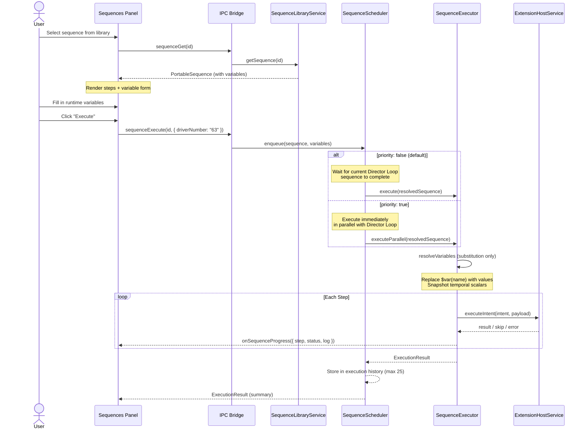

# Feature: Sequence Executor User Experience

## 1. Overview

The Sequence Executor UX provides the user-facing interface for the headless `SequenceExecutor` engine. While the executor runtime already exists as a core service in the main process, it currently has **no dedicated UI** — sequences are only triggered programmatically by the Director Loop (cloud AI) or internally by code.

This feature elevates the Sequence Executor to a first-class citizen in the Director App, giving it:
- A **sidebar navigation icon** (consistent with extensions like iRacing, OBS, Discord)
- A **dashboard status card** (widget) on the home screen
- A **full panel view** with sequence browsing, inspection, and manual execution
- A design that enables **future AI agent invocation** and **Stream Deck / hardware integration**

### Why This Matters
The Sequence Executor is the **heart of the Director App**. Every action the system takes — whether triggered by the cloud AI, a manual button press, or a hardware controller — flows through it. Giving users visibility into what sequences exist, what they do, and the ability to run them manually transforms the Director from a "black box agent" into a transparent "broadcast control room."

---

## 2. Design Principles

| Principle | Description |
|:---|:---|
| **Transparency** | Users must be able to see what intents/events the system supports and what sequences are available. |
| **Manual First** | Every sequence the AI can run, the user can run manually. The UI is the "free tier" of broadcast control. |
| **Runtime Variables** | Sequences are templates. Some steps require values provided at execution time (e.g., "which driver?"). |
| **Extensible Invocation** | The sequence library must be invocable from: UI buttons, AI agent, Stream Deck, webhooks, keyboard shortcuts. |
| **Soft Failure Visibility** | When a step skips (missing handler) or fails, the UI must show this clearly — not silently swallow errors. |

---

## 3. Information Architecture

### 3.1 Navigation

The Sequence Executor registers as a **core view** (not an extension) in the sidebar, positioned between the Dashboard and the first extension icon.

| Property | Value |
|:---|:---|
| **Sidebar Icon** | `Zap` (Lucide) — represents automation/sequences |
| **Sidebar Label** | "Sequences" |
| **View ID** | `sequences` |
| **Position** | After Dashboard, before extensions |

### 3.2 Dashboard Widget

A status card on the Dashboard home screen, rendered alongside extension widgets in the control cards grid.

**Widget States:**

| State | Visual | Description |
|:---|:---|:---|
| **Idle** | Grey dot, "READY" | No sequence executing, system ready |
| **Executing** | Pulsing orange dot, sequence name + progress | A sequence is actively running |
| **Error** | Red dot, "LAST RUN FAILED" | Most recent sequence had step failures |
| **No Sequences** | Yellow dot, "NO SEQUENCES" | Library is empty, prompts user to create |

**Widget Content:**
- Header: `Zap` icon + "SEQUENCE EXECUTOR" label + status dot
- Body: Last executed sequence name + timestamp, or current sequence progress (step 3/7)
- Footer: "OPEN SEQUENCES" button → navigates to full panel
- Stats line: `{n} sequences available · {m} intents registered`

### 3.3 Full Panel Layout

The Sequences panel is divided into a **two-column layout** with a collapsible sidebar.

```
┌─────────────────────────────────────────────────────────┐
│  SEQUENCE EXECUTOR                          [▶ Run] [⚙] │
├──────────────┬──────────────────────────────────────────┤
│              │                                          │
│  LIBRARY     │  SEQUENCE DETAIL / EXECUTION VIEW        │
│              │                                          │
│  ┌────────┐  │  ┌──────────────────────────────────┐    │
│  │ Search │  │  │  Stream Introduction             │    │
│  └────────┘  │  │  v1.0.0 · 4 steps · ~12s         │    │
│              │  └──────────────────────────────────┘    │
│  ▸ Built-in  │                                          │
│    Intro     │  STEPS                                   │
│    Replay    │  ┌─ 1. obs.switchScene ─────────────┐    │
│              │  │  Scene: "Driver Overview"    [OBS]│    │
│  ▸ Cloud     │  └─────────────────────────────────┘    │
│    Race Start│  ┌─ 2. broadcast.selectCamera ─────┐    │
│    Safety    │  │  Camera: "Scenic"         [iRace]│    │
│              │  └─────────────────────────────────┘    │
│  ▸ Custom    │  ┌─ 3. communication.talkToChat ───┐    │
│    My Seq 1  │  │  Message: "Welcome to..."   [YT] │    │
│              │  └─────────────────────────────────┘    │
│              │  ┌─ 4. system.wait ────────────────┐    │
│              │  │  Duration: 3000ms         [SYS] │    │
│              │  └─────────────────────────────────┘    │
│              │                                          │
│──────────────│  RUNTIME VARIABLES                       │
│              │  ┌──────────────────────────────────┐    │
│  INTENTS &   │  │  No variables required           │    │
│  EVENTS      │  └──────────────────────────────────┘    │
│              │                                          │
│  ▾ Intents   │  ──────────────────────────────────      │
│  system.wait │                                          │
│  system.log  │  EXECUTION LOG                           │
│  obs.switch  │  ┌──────────────────────────────────┐    │
│  broadcast.  │  │  (empty — run to see output)     │    │
│  comms.chat  │  └──────────────────────────────────┘    │
│              │                                          │
│  ▾ Events    │                                          │
│  iracing.    │                                          │
│  flagChanged │                                          │
│              │                                          │
└──────────────┴──────────────────────────────────────────┘
```

---

## 4. Panel Sections (Detailed)

### 4.1 Sequence Library (Left Panel)

The library is a scrollable, searchable list of all available sequences organized into categories.

#### Categories

| Category | Source | Description |
|:---|:---|:---|
| **Built-in** | Shipped with Director | Default sequences for common broadcast scenarios |
| **Cloud** | Fetched from Race Control API | Sequences defined by the broadcast director in the cloud portal |
| **Custom** | User-created locally | Sequences the user has created or imported as JSON files |

#### Library Item Display
Each item shows:
- Sequence name (bold)
- Step count + estimated duration
- Source badge (Built-in / Cloud / Custom)
- Status indicator if currently executing

#### Search & Filter
- Text search across sequence names and step intents
- Filter by category (Built-in / Cloud / Custom)
- Filter by intent domain (e.g., "show only sequences using OBS")

### 4.2 Intents & Events Browser (Left Panel, Collapsible)

Below the library, a collapsible accordion shows the full **Capability Catalog** — all intents and events registered by active extensions and the system.

#### Intents Section
For each registered intent:
- **Intent ID**: `obs.switchScene`
- **Source Extension**: OBS (with extension icon)
- **Label**: "Switch OBS Scene"
- **Input Schema**: Rendered as a readable parameter list
  - `sceneName` (string, required)
  - `transition` (string, optional)
  - `duration` (number, optional)
- **Status badge**: Active (green) / Inactive (grey) / Missing (red)

#### Events Section
For each registered event:
- **Event ID**: `iracing.flagChanged`
- **Source Extension**: iRacing
- **Label**: "Race Flag Changed"
- **Payload Schema**: Parameter list of emitted data
- **Mapping indicator**: Shows if this event is mapped to trigger any sequence

**Purpose**: This section serves as a live reference for users building custom sequences. It also signals to the user which capabilities are currently available, helping debug "why didn't my sequence work?" scenarios.

### 4.3 Sequence Detail View (Right Panel)

When a sequence is selected from the library, the right panel renders the full sequence detail.

#### Header
- Sequence name (editable for Custom sequences)
- Version tag
- Step count + estimated total duration (sum of `system.wait` durations + a default per-step estimate)
- **Run button** (▶): Primary action, triggers execution
- **Edit button** (✏️): Opens the visual sequence builder
- **Export button** (📋): Copies PortableSequence JSON to clipboard
- **Delete button** (🗑️): Only for Custom sequences

#### Steps List
An ordered visual list of each `SequenceStep`:
- Step number
- Intent ID with domain color coding:
  - `system.*` → muted/grey
  - `broadcast.*` → primary (orange)
  - `obs.*` → secondary (blue)
  - `communication.*` → green
- Payload rendered as key-value pairs
- Extension source badge
- Handler status: ✅ Active | ⚠️ Inactive | ❌ Missing

Steps with **runtime variables** (see §5) are highlighted with a variable indicator badge.

#### Runtime Variables Form (see §5)
If the selected sequence contains parameterized steps, a form section appears allowing the user to fill in values before execution.

#### Execution Log
A live, scrollable log output area that shows step-by-step execution progress:
```
[12:34:01.123] ▶ Starting sequence: "Stream Introduction" (4 steps)
[12:34:01.125] ✅ Step 1/4: obs.switchScene → Scene: "Driver Overview" (42ms)
[12:34:01.168] ✅ Step 2/4: broadcast.selectCamera → Camera: "Scenic" (15ms)
[12:34:01.185] ✅ Step 3/4: communication.talkToChat → Sent (230ms)
[12:34:01.420] ⏳ Step 4/4: system.wait → Waiting 3000ms...
[12:34:04.422] ✅ Step 4/4: system.wait → Complete
[12:34:04.423] 🏁 Sequence complete: 4/4 steps succeeded (3.3s)
```

Failure states:
```
[12:34:01.125] ⚠️ Step 2/4: obs.switchScene → SKIPPED (no active handler)
[12:34:01.126] ❌ Step 3/4: communication.announce → FAILED: Connection refused
```

---

## 5. Runtime Variables

### 5.1 The Problem
Many useful sequences are **templates** that need context at execution time. Examples:
- "Show replay for **driver X**" — which driver?
- "Rewind **N seconds**" — how far back?
- "Switch to **scene Y**" — which scene?

Hardcoding these values makes sequences inflexible. The AI can fill them dynamically, but for manual execution the user needs a way to provide them.

### 5.2 Solution: Variable Placeholders

Sequence payloads can contain **variable references** using a `$var(name)` syntax. Variables are strictly **substitution-only** — no arithmetic or expression evaluation is permitted. This keeps the system simple, secure, and deterministic.

```json
{
  "id": "seq_replay_driver",
  "name": "Show Replay for Driver",
  "variables": [
    {
      "name": "driverNumber",
      "label": "Driver Number",
      "type": "string",
      "required": true,
      "description": "The car number of the driver to show",
      "source": "user | context",
      "contextKey": "iracing.drivers[].carNumber"
    },
    {
      "name": "replayToSessionTime",
      "label": "Replay To Session Time",
      "type": "number",
      "required": true,
      "description": "The session time (in seconds) to replay from. Temporal scalar — idempotent.",
      "source": "context",
      "contextKey": "iracing.sessionTime"
    }
  ],
  "steps": [
    {
      "id": "step_1",
      "intent": "broadcast.replayFromSessionTime",
      "payload": { "sessionTime": "$var(replayToSessionTime)" }
    },
    {
      "id": "step_2",
      "intent": "broadcast.showLiveCam",
      "payload": { "carNum": "$var(driverNumber)", "camGroup": "TV1" }
    },
    {
      "id": "step_3",
      "intent": "obs.switchScene",
      "payload": { "sceneName": "Replay" }
    },
    {
      "id": "step_4",
      "intent": "system.waitUntilSessionTime",
      "payload": { "sessionTime": "$var(replayToSessionTime)" }
    },
    {
      "id": "step_5",
      "intent": "obs.switchScene",
      "payload": { "sceneName": "Live Race" }
    }
  ]
}
```

### 5.3 Variable Definition

```typescript
interface SequenceVariable {
  name: string;              // Variable identifier (alphanumeric, camelCase)
  label: string;             // Human-readable label for UI
  type: 'string' | 'number' | 'boolean' | 'select' | 'sessionTime' | 'sessionTick';
  required: boolean;
  default?: unknown;         // Default value (used if not provided)
  description?: string;      // Help text shown in UI
  constraints?: {
    min?: number;            // For number type
    max?: number;            // For number type
    options?: Array<{        // For select type
      label: string;
      value: string;
    }>;
    pattern?: string;        // Regex for string type
  };
  source?: 'user' | 'context';  // Where the value comes from
  contextKey?: string;       // Dot-path for auto-population from telemetry/session data
}
```

#### Temporal Scalar Types

The `sessionTime` and `sessionTick` variable types represent **idempotent temporal scalars** from the iRacing telemetry stream. Unlike offset-based values ("rewind 10 seconds"), these are absolute positions in the session timeline:

- **`sessionTime`**: The session elapsed time in seconds (float). Example: `2345.67` means 2345.67 seconds into the session.
- **`sessionTick`**: The simulation tick counter (integer). Monotonically increasing, frame-accurate.

These values are idempotent — replaying to `sessionTime: 2345.67` always produces the same result regardless of when the sequence is executed. This makes them safe for:
- Queued execution (value captured at queue time, replayed later)
- AI agent invocation (cloud provides the exact timestamp)
- Audit/replay of past executions

```typescript
// Context auto-population for temporal scalars
// When source is "context", the executor snapshots the current value at queue time:
const sessionTime = iracingTelemetry.getSessionTime();  // e.g., 2345.67
const sessionTick = iracingTelemetry.getSessionTick();  // e.g., 142340
```

### 5.4 Extended PortableSequence

The `PortableSequence` type gains an optional `variables` array and a `priority` flag:

```typescript
interface PortableSequence {
  id: string;
  name?: string;
  version?: string;
  description?: string;       // NEW: Human-readable description
  category?: 'built-in' | 'cloud' | 'custom';  // NEW: Library category
  priority?: boolean;          // NEW: If true, executes immediately even during Director Loop
  variables?: SequenceVariable[];  // NEW: Runtime variable definitions
  steps: SequenceStep[];
  metadata?: Record<string, unknown>;
}
```

### 5.5 Variable Resolution Pipeline

Variable resolution is **substitution-only** — no expression evaluation. The `$var(name)` reference is replaced with the resolved value verbatim.

Resolution order:

```
1. Explicit values     →  User typed "63" into the form, or AI provided { driverNumber: "63" }
2. Context values      →  Auto-populated from live telemetry/session data (contextKey)
                          Temporal scalars (sessionTime, sessionTick) are snapshotted at queue time
3. Default values      →  Variable definition has default: 10
4. Unresolved          →  Error: required variable missing → block execution
```

**No expression evaluation**: Values like `$var(rewindSeconds * 1000)` are **not supported**. If a step needs a derived value, define a separate variable or handle the conversion in the intent handler. This eliminates injection risks and keeps sequences portable.

### 5.6 UI: Runtime Variables Form

When a sequence with variables is selected and the user clicks **Run**, a form renders between the steps list and execution log:

```
┌─ RUNTIME VARIABLES ──────────────────────────────┐
│                                                   │
│  Driver Number *          [  63  ] ▾              │
│  (Car number to show)     [Populated from iRacing]│
│                                                   │
│  Rewind Duration *        [ 10 ] seconds          │
│  (How far back to go)     [Default: 10]           │
│                                                   │
│              [ Cancel ]  [ ▶ Execute Sequence ]   │
└───────────────────────────────────────────────────┘
```

- **Select type** variables render as dropdowns pre-populated with options or live data
- **Context-aware** variables (e.g., `iracing.drivers[].carNumber`) can auto-populate dropdowns from live session data when the iRacing extension is active
- **Required** variables are marked with `*` and block execution if empty
- **Defaults** are pre-filled but editable

### 5.7 Variable Resolution for Non-UI Invocation

When sequences are invoked programmatically (AI agent, Stream Deck, API):

| Invoker | Variable Source |
|:---|:---|
| **AI Agent** | Variables provided in the execution payload alongside the sequence ID |
| **Stream Deck** | Variables pre-configured in the button mapping (static) or derived from context (dynamic) |
| **Director Loop (Cloud)** | Variables embedded in the API response payload |
| **Webhook** | Variables passed as query parameters or request body |

---

## 6. Example Sequences

### 6.1 Stream Introduction

**Description**: Opens the broadcast with a driver overview and scenic cameras.

```json
{
  "id": "seq_stream_intro",
  "name": "Stream Introduction",
  "version": "1.0.0",
  "description": "Opens the broadcast with driver overview and scenic cameras, then sends a welcome message to YouTube chat.",
  "category": "built-in",
  "variables": [],
  "steps": [
    {
      "id": "step_1",
      "intent": "obs.switchScene",
      "payload": { "sceneName": "Driver Overview" },
      "metadata": { "label": "Switch to Driver Overview" }
    },
    {
      "id": "step_2",
      "intent": "broadcast.selectCamera",
      "payload": { "camGroup": "Scenic" },
      "metadata": { "label": "Select scenic cameras in iRacing" }
    },
    {
      "id": "step_3",
      "intent": "communication.talkToChat",
      "payload": { "message": "🏁 Welcome to Sim RaceCenter! The stream is starting now. Get ready for some incredible racing action!" },
      "metadata": { "label": "Send welcome message to YouTube chat" }
    }
  ]
}
```

### 6.2 Show Replay for Driver

**Description**: Replays the last few seconds for a specific driver using an absolute session timestamp, then returns to live.

```json
{
  "id": "seq_replay_driver",
  "name": "Show Replay for Driver",
  "version": "1.0.0",
  "description": "Jumps iRacing to an absolute session time for a specific driver on the replay scene, then automatically returns to live racing when the replay catches up.",
  "category": "built-in",
  "variables": [
    {
      "name": "driverNumber",
      "label": "Driver Number",
      "type": "select",
      "required": true,
      "description": "The car number of the driver to show",
      "source": "context",
      "contextKey": "iracing.drivers"
    },
    {
      "name": "replayToSessionTime",
      "label": "Replay To Session Time",
      "type": "sessionTime",
      "required": true,
      "description": "The absolute session time to replay from. Auto-captured from iRacing telemetry.",
      "source": "context",
      "contextKey": "iracing.sessionTime"
    }
  ],
  "steps": [
    {
      "id": "step_1",
      "intent": "broadcast.replayFromSessionTime",
      "payload": { "sessionTime": "$var(replayToSessionTime)" },
      "metadata": { "label": "Replay from session time" }
    },
    {
      "id": "step_2",
      "intent": "broadcast.showLiveCam",
      "payload": { "carNum": "$var(driverNumber)", "camGroup": "TV1" },
      "metadata": { "label": "Switch to driver camera" }
    },
    {
      "id": "step_3",
      "intent": "obs.switchScene",
      "payload": { "sceneName": "Replay" },
      "metadata": { "label": "Switch OBS to Replay scene" }
    },
    {
      "id": "step_4",
      "intent": "system.waitUntilSessionTime",
      "payload": { "sessionTime": "$var(replayToSessionTime)" },
      "metadata": { "label": "Wait until session catches up to live" }
    },
    {
      "id": "step_5",
      "intent": "obs.switchScene",
      "payload": { "sceneName": "Live Race" },
      "metadata": { "label": "Return to live scene" }
    }
  ]
}
```

### 6.3 Safety Car Protocol

**Description**: Full broadcast protocol when a safety car is deployed.

```json
{
  "id": "seq_safety_car",
  "name": "Safety Car Protocol",
  "version": "1.0.0",
  "description": "Deploys the full safety car broadcast protocol: switches to track map, mutes drivers, announces to chat, then returns to normal after a delay.",
  "category": "built-in",
  "variables": [
    {
      "name": "returnDelayMs",
      "label": "Return to Normal Delay (ms)",
      "type": "number",
      "required": false,
      "default": 30000,
      "description": "How long to wait before returning to normal broadcast (in milliseconds)",
      "constraints": { "min": 5000, "max": 120000 }
    }
  ],
  "steps": [
    {
      "id": "step_1",
      "intent": "obs.switchScene",
      "payload": { "sceneName": "Track Map" },
      "metadata": { "label": "Show track map" }
    },
    {
      "id": "step_2",
      "intent": "communication.announce",
      "payload": { "message": "⚠️ Safety car deployed. Drivers hold your positions." },
      "metadata": { "label": "Announce to Discord" }
    },
    {
      "id": "step_3",
      "intent": "communication.talkToChat",
      "payload": { "message": "🟡 SAFETY CAR — Full course yellow" },
      "metadata": { "label": "Announce to YouTube chat" }
    },
    {
      "id": "step_4",
      "intent": "system.wait",
      "payload": { "durationMs": "$var(returnDelayMs)" },
      "metadata": { "label": "Wait before returning to normal" }
    },
    {
      "id": "step_5",
      "intent": "obs.switchScene",
      "payload": { "sceneName": "Live Race" },
      "metadata": { "label": "Return to live race view" }
    }
  ]
}
```

---

## 7. Sequence Library Storage & Sources

### 7.1 Storage Locations

| Category | Storage | Format | Mutable |
|:---|:---|:---|:---|
| **Built-in** | Bundled in app at `src/renderer/sequences/built-in/` | JSON files | No (read-only) |
| **Cloud** | Fetched from Race Control API, cached locally | API response → PortableSequence | No (read-only, refreshed on sync) |
| **Custom** | User data directory (`userData/sequences/`) | JSON files | Yes (full CRUD) |

### 7.2 Library Service (Main Process)

```typescript
interface SequenceLibraryService {
  // Library management
  listSequences(filter?: { category?: string; search?: string }): Promise<PortableSequence[]>;
  getSequence(id: string): Promise<PortableSequence | null>;
  
  // Custom sequence CRUD
  saveCustomSequence(sequence: PortableSequence): Promise<void>;
  deleteCustomSequence(id: string): Promise<void>;
  importSequence(json: string): Promise<PortableSequence>;  // Validate & save
  exportSequence(id: string): Promise<string>;               // JSON string
  
  // Cloud sync
  syncCloudSequences(sessionId: string): Promise<void>;
  
  // Capability catalog
  getRegisteredIntents(): Promise<IntentCatalogEntry[]>;
  getRegisteredEvents(): Promise<EventCatalogEntry[]>;
}
```

### 7.3 IPC API (Renderer ↔ Main)

New IPC channels exposed via `contextBridge`:

```typescript
interface IElectronAPI {
  // ... existing methods ...
  
  // Sequence Library
  sequenceList(filter?: SequenceFilter): Promise<PortableSequence[]>;
  sequenceGet(id: string): Promise<PortableSequence | null>;
  sequenceSave(sequence: PortableSequence): Promise<void>;
  sequenceDelete(id: string): Promise<void>;
  sequenceExport(id: string): Promise<string>;
  sequenceImport(json: string): Promise<PortableSequence>;
  
  // Sequence Execution (via SequenceScheduler)
  sequenceExecute(id: string, variables?: Record<string, unknown>, options?: {
    priority?: boolean;
    source?: string;
  }): Promise<string>;  // Returns execution ID
  sequenceCancel(): Promise<void>;
  sequenceCancelQueued(executionId: string): Promise<void>;
  sequenceQueue(): Promise<QueuedSequence[]>;
  onSequenceProgress(callback: (progress: SequenceProgress) => void): () => void;
  
  // Execution History (in-memory, max 25)
  sequenceHistory(): Promise<ExecutionResult[]>;
  
  // Capability Catalog
  catalogIntents(): Promise<IntentCatalogEntry[]>;
  catalogEvents(): Promise<EventCatalogEntry[]>;
}
```

---

## 8. Execution Model

### 8.1 Execution Flow



### 8.2 Variable Resolution

Before execution, the executor runs a substitution-only resolution pass:

1. **Parse**: Scan all step payloads for `$var(name)` references
2. **Resolve**: Replace each reference with the value from the provided variables map (direct substitution, no expression evaluation)
3. **Snapshot temporals**: For `sessionTime` / `sessionTick` variables with `source: "context"`, capture the current telemetry value at resolution time
4. **Validate**: Check all required variables have values; error if any are missing
5. **Type coerce**: Cast values to match the variable's declared type

### 8.3 Execution Result

```typescript
interface ExecutionResult {
  sequenceId: string;
  sequenceName: string;
  status: 'completed' | 'partial' | 'failed' | 'cancelled';
  source: 'manual' | 'director-loop' | 'ai-agent' | 'stream-deck' | 'webhook';
  priority: boolean;
  startedAt: string;
  completedAt: string;
  totalDurationMs: number;
  resolvedVariables: Record<string, unknown>;  // Snapshot of resolved variable values
  steps: StepResult[];
}

interface StepResult {
  stepId: string;
  intent: string;
  status: 'success' | 'skipped' | 'failed';
  durationMs: number;
  message?: string;  // Error message or skip reason
}

interface SequenceProgress {
  sequenceId: string;
  currentStep: number;
  totalSteps: number;
  stepIntent: string;
  stepStatus: 'running' | 'success' | 'skipped' | 'failed';
  log: string;       // Formatted log line
}
```

### 8.4 Execution Concurrency

The executor supports two concurrency behaviors controlled by the `priority` flag on the sequence:

#### Default Behavior (`priority: false`)
The **SequenceScheduler** queues the manual sequence and waits for the current Director Loop sequence to complete before executing. This is the safe default for stateful or complex orchestrations where step ordering matters.

```
Director Loop: [Seq A: step1 → step2 → step3] → complete
Manual Queue:                                     [Seq B: step1 → step2] → complete
```

- The user sees "QUEUED" status in the UI with position in queue
- The Director Loop is not interrupted
- Guarantees no conflicting commands (e.g., two scenes switching simultaneously)

#### Priority Override (`priority: true`)
The sequence is marked as **priority** and executes **simultaneously** alongside whatever the Director Loop is running. The SequenceScheduler spawns a parallel execution context.

```
Director Loop: [Seq A: step1 → step2 → step3 →  step4]
Priority:            [Seq B: step1 → step2 → step3]
```

- The user explicitly opts into this via a toggle in the execution UI
- Intended for time-critical interruptions (e.g., "show this crash NOW")
- **Warning**: Conflicting commands (e.g., both sequences switching OBS scenes) will race. The UI displays a caution indicator when priority mode is selected
- The sequence definition can set `priority: true` as a default (e.g., built-in "Incident Replay" sequences)

#### SequenceScheduler Service

```typescript
interface SequenceScheduler {
  // Queue a sequence for execution
  enqueue(sequence: PortableSequence, variables: Record<string, unknown>, options?: {
    source: 'manual' | 'director-loop' | 'ai-agent' | 'stream-deck' | 'webhook';
    priority?: boolean;  // Override sequence default
  }): Promise<string>;  // Returns execution ID
  
  // Query state
  getQueue(): QueuedSequence[];
  isExecuting(): boolean;
  cancelCurrent(): Promise<void>;
  cancelQueued(executionId: string): Promise<void>;
  
  // History (in-memory ring buffer, default max 25)
  getHistory(): ExecutionResult[];
}

interface QueuedSequence {
  executionId: string;
  sequence: PortableSequence;
  variables: Record<string, unknown>;
  queuedAt: string;
  position: number;
  source: string;
}
```

### 8.5 Execution History

The SequenceScheduler maintains an **in-memory ring buffer** of the last N execution results (default: **25**, configurable).

- History is **not persisted to disk** — it resets on app restart
- Each entry is an `ExecutionResult` with resolved variables, step-by-step results, and timing
- The UI displays history in the Sequences panel as a collapsible section below the execution log
- History entries are selectable — clicking one shows its full execution log and resolved variables
- Useful for debugging "what just happened?" during a live broadcast

```typescript
interface ExecutionHistoryConfig {
  maxEntries: number;  // Default: 25
}
```

---

## 9. Future Integration Points

### 9.1 AI Agent Invocation

The AI Director (Race Control Cloud) can invoke sequences from the library by ID, providing runtime variables:

```json
{
  "action": "executeSequence",
  "sequenceId": "seq_replay_driver",
  "variables": {
    "driverNumber": "63",
    "rewindSeconds": 15
  }
}
```

The AI agent discovers available sequences via the **Capabilities Handshake** (see Extension System spec §2.5.3). The sequence library is included in the capability catalog sent to the cloud, allowing the AI to reason about which sequences to invoke based on race context.

**New API Command Type**: `EXECUTE_SEQUENCE`
```typescript
// In the legacy INTENT_MAP, add:
'EXECUTE_SEQUENCE' → resolved by SequenceLibraryService.getSequence() + SequenceExecutor.execute()
```

### 9.2 Stream Deck / Hardware Integration

A hardware controller extension (e.g., Stream Deck) can map physical buttons to sequence execution:

```json
{
  "buttonId": 5,
  "action": "executeSequence",
  "sequenceId": "seq_stream_intro",
  "variables": {}
}
```

For sequences requiring runtime variables, two modes are available:

1. **Static binding**: Variables are pre-configured in the button mapping (e.g., Button 5 always replays Driver 63)
2. **Context binding**: Variables use `source: "context"` and are auto-populated from live telemetry at execution time (e.g., "currently focused driver")

### 9.3 Webhook / REST Trigger

A future HTTP endpoint on the Director can accept sequence execution requests:

```
POST /api/sequences/{sequenceId}/execute
Content-Type: application/json

{
  "variables": {
    "driverNumber": "63"
  },
  "source": "webhook"
}
```

### 9.4 Keyboard Shortcuts

Users can bind keyboard shortcuts to execute sequences directly:

```json
{
  "keybinding": "Ctrl+Shift+1",
  "action": "executeSequence",
  "sequenceId": "seq_stream_intro"
}
```

---

## 10. Implementation Plan

### Phase 1: Foundation (MVP)

**Goal**: Sequence library browsable, buildable, and manually executable from the UI with full concurrency support.

| Task | Description |
|:---|:---|
| **Data types** | Extend `PortableSequence` with `variables`, `description`, `category`, `priority` fields |
| **SequenceLibraryService** | Main process service for loading/saving sequences from disk |
| **SequenceScheduler** | Concurrency manager: queue (default) + priority parallel execution |
| **Built-in sequences** | Ship 3-4 example sequences as JSON files |
| **IPC channels** | Expose library, execution, and history methods to renderer |
| **Dashboard widget** | `SequencesDashboardCard` component |
| **Sidebar nav entry** | Register as a core view in sidebar, positioned after Dashboard |
| **Sequences panel** | Two-column layout with library list + detail view |
| **Visual sequence builder** | Drag-and-drop editor for creating/editing custom sequences (see §10.1) |
| **Execution log** | Real-time step progress in the UI |
| **Execution history** | In-memory ring buffer (max 25), viewable in UI |
| **Variable resolution** | `$var(name)` substitution-only parsing in executor |
| **Temporal scalars** | `sessionTime` / `sessionTick` variable types with context auto-capture |
| **Runtime variables form** | Dynamic form rendering from `SequenceVariable[]` definitions |
| **Intents catalog UI** | List all registered intents with schemas and status |
| **Events catalog UI** | List all registered events with schemas |

#### 10.1 Visual Sequence Builder (MVP Scope)

The visual sequence builder is included in Phase 1. It provides a structured UI for creating and editing custom sequences without requiring JSON knowledge.

**Builder Components:**

| Component | Description |
|:---|:---|
| **Sequence metadata form** | Name, description, version, priority toggle |
| **Step palette** | Browsable list of available intents (from Capability Catalog), drag onto the sequence |
| **Step list (orderable)** | Drag-and-drop reordering of steps in the sequence |
| **Step editor** | Per-step form: select intent from dropdown, fill payload fields from intent's input schema |
| **Variable manager** | Add/remove/edit variable definitions; link variables to step payload fields |
| **Preview** | Read-only JSON preview of the resulting `PortableSequence` |
| **Validation** | Real-time validation: required fields, intent availability, variable references |

**Builder UX Flow:**
```
┌─────────────────────────────────────────────────────────────┐
│  CREATE NEW SEQUENCE                        [Save] [Cancel] │
├─────────────────────────────────────────────────────────────┤
│                                                             │
│  Name:  [ Safety Car Protocol          ]                    │
│  Desc:  [ Full course yellow broadcast  ]                   │
│  ☐ Priority (execute immediately, even during Director Loop)│
│                                                             │
│  ─── VARIABLES ──────────────────────────── [+ Add Variable]│
│  ┌──────────────────────────────────────────────────────┐   │
│  │ returnDelay  │ number │ default: 30 │ user    [✕]    │   │
│  └──────────────────────────────────────────────────────┘   │
│                                                             │
│  ─── STEPS ─────────────────────────────────── [+ Add Step] │
│  ┌─ 1 ──────────────────────────────────────────── [⋮] [✕] │
│  │  Intent: [ obs.switchScene          ▾]                   │
│  │  sceneName: [ Track Map             ]                    │
│  └──────────────────────────────────────────────────────┘   │
│  ┌─ 2 ──────────────────────────────────────────── [⋮] [✕] │
│  │  Intent: [ communication.announce   ▾]                   │
│  │  message:  [ Safety car deployed... ]                    │
│  └──────────────────────────────────────────────────────┘   │
│  ┌─ 3 ──────────────────────────────────────────── [⋮] [✕] │
│  │  Intent: [ system.wait              ▾]                   │
│  │  durationMs: [ $var(returnDelay)    ]  ← variable ref    │
│  └──────────────────────────────────────────────────────┘   │
│                                                             │
│  ─── PREVIEW (JSON) ─────────────────────────── [Copy JSON] │
│  ┌──────────────────────────────────────────────────────┐   │
│  │ { "id": "seq_custom_1", "name": "Safety..." ...     │   │
│  └──────────────────────────────────────────────────────┘   │
│                                                             │
└─────────────────────────────────────────────────────────────┘
```

**Key Design Decisions:**
- Intent selection uses a dropdown populated from the **Capability Catalog** — users can only select intents that exist
- Payload fields are rendered dynamically from the intent's **Input Schema** (JSON Schema from the extension manifest)
- Variable references are inserted via a `$var(...)` helper button, not by typing raw syntax
- Steps support drag handles (`⋮`) for reordering
- The builder validates in real-time: warns if an intent's extension is disabled, errors on missing required payload fields
- Saved sequences are written as `PortableSequence` JSON to `userData/sequences/` with `category: "custom"`

### Phase 2: Cloud & Import/Export

| Task | Description |
|:---|:---|
| **Cloud sync** | Fetch sequences from Race Control API and cache locally |
| **Import / Export** | Copy/paste JSON, file import/export |
| **Sequence validation** | Validate intents exist in catalog before save |

### Phase 3: External Invocation

| Task | Description |
|:---|:---|
| **AI agent integration** | `EXECUTE_SEQUENCE` command type in Director Loop |
| **Stream Deck mapping** | Button → sequence binding in hardware extension |
| **Keyboard shortcuts** | Global shortcut → sequence binding |
| **Webhook endpoint** | HTTP trigger for external systems |

---

## 11. UI Component Hierarchy

```
src/renderer/
├── pages/
│   └── SequencesPanel.tsx              # Full panel view (main content area)
├── components/
│   └── sequences/
│       ├── SequencesDashboardCard.tsx   # Dashboard widget
│       ├── SequenceLibrary.tsx          # Left panel: library list
│       ├── SequenceLibraryItem.tsx      # Individual library entry
│       ├── SequenceDetail.tsx           # Right panel: sequence detail view
│       ├── SequenceStepCard.tsx         # Individual step visualization
│       ├── SequenceVariablesForm.tsx    # Runtime variables input form
│       ├── SequenceExecutionLog.tsx     # Real-time execution log
│       ├── SequenceExecutionHistory.tsx # Ring buffer history list
│       ├── SequenceBuilder.tsx          # Visual sequence builder (create/edit)
│       ├── SequenceBuilderStepEditor.tsx # Per-step intent + payload form
│       ├── SequenceBuilderVariableManager.tsx # Variable definition CRUD
│       ├── IntentsCatalog.tsx           # Collapsible intents browser
│       ├── EventsCatalog.tsx            # Collapsible events browser
│       └── IntentBadge.tsx             # Domain-colored intent chip

src/main/
├── sequence-library-service.ts         # Library CRUD, built-in/cloud/custom loading
├── sequence-scheduler.ts               # Concurrency: queue + priority parallel execution
├── sequence-executor.ts                # (existing) Headless executor — extended with $var() resolution
```

---

## 12. Design Token Usage

All components adhere to the Director brand design system:

| Element | Token / Class |
|:---|:---|
| Panel background | `bg-background` (#090B10) |
| Cards / Step cards | `bg-card border-border` (#111317) |
| Sequence name | `font-rajdhani uppercase tracking-wider` |
| Step payload values | `font-jetbrains` (monospace, tabular) |
| Run button | `bg-primary text-primary-foreground` (Apex Orange) |
| Intent badges (system) | `bg-muted text-muted-foreground` |
| Intent badges (broadcast) | `bg-primary/20 text-primary` |
| Intent badges (obs) | `bg-secondary/20 text-secondary` |
| Intent badges (comms) | `bg-green-500/20 text-green-400` |
| Status: Active | `text-green-400` |
| Status: Warning | `text-[--yellow-flag]` |
| Status: Error | `text-destructive` |
| Execution log | `font-jetbrains text-sm bg-black/30 rounded-lg` |
| Variable labels | `font-rajdhani text-sm uppercase tracking-wide text-muted-foreground` |
| Variable inputs | `bg-background border-border font-jetbrains` |

---

## 13. Resolved Design Decisions

The following questions were resolved during specification refinement:

| # | Question | Decision | Rationale |
|:--|:---|:---|:---|
| 1 | **Sequence Editor in MVP?** | **Yes** — visual builder included in Phase 1 | The sequence builder is essential for the "Manual First" principle. Users need to create sequences without JSON knowledge. See §10.1. |
| 2 | **Execution Concurrency** | **Queue (default) + Priority override** | Default: manual sequences queue behind Director Loop. Priority flag (`priority: true`) enables simultaneous parallel execution for time-critical interruptions. See §8.4. |
| 3 | **Variable Expressions** | **Substitution only — no expression evaluation** | `$var(name)` is direct substitution. No arithmetic (`$var(x * 1000)`) is supported. Temporal scalars (`sessionTime`, `sessionTick`) replace offset-based values as idempotent alternatives. See §5.2, §5.3. |
| 4 | **Execution History** | **In-memory ring buffer, max 25 entries** | Not persisted to disk. Resets on restart. Sufficient for live broadcast debugging. Configurable via `maxEntries`. See §8.5. |
| 5 | **Sequence Versioning** | **Simple overwrite** | No version history tracking for custom sequences. Save overwrites the previous version. |
| 6 | **Context Auto-Population Depth** | **Single-depth key lookups only** | Context binding is limited to simple key lookups (e.g., `iracing.drivers`, `iracing.sessionTime`). Complex aggregation queries (e.g., "driver in P1") are intentionally out of scope — cross-rig intelligence is a premium cloud service via Race Control, not a local Director capability. This preserves the open-source/premium product boundary. |
| 7 | **Builder Undo/Redo** | **Save/discard model** | The visual sequence builder uses a simple save/discard workflow. No undo/redo stack in MVP. |

## 14. Open Questions

1. **Cloud Sequence Format**: Does the Race Control API already serve sequences in `PortableSequence` format, or do we need an additional normalization layer? **Pending review with Race Control team** — tracked in [racecontrol#136](https://github.com/margic/racecontrol/issues/136).
